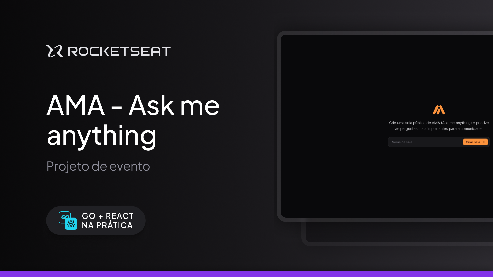

<h1 align="center">AMA (Ask me anything)</h1>

  
  
  

  O projeto é um site desktop de sala de perguntas.
  Esse é um dos projetos do evento Go+React na Prática, um dos conteúdos disponíveis para alunos da Rocketseat.

  <a href="#-tecnologias">Tecnologias</a>&nbsp;&nbsp;&nbsp;|&nbsp;&nbsp;&nbsp;
  <a href="#-projeto">Projeto</a>&nbsp;&nbsp;&nbsp;|&nbsp;&nbsp;&nbsp;
  <a href="#-layout">Layout</a>&nbsp;&nbsp;&nbsp;|&nbsp;&nbsp;&nbsp;
  <a href="#-como-executar">Como executar</a>&nbsp;&nbsp;&nbsp;|&nbsp;&nbsp;&nbsp;
  <a href="#-agradecimentos">Agradecimentos</a>

  

## ✨ Tecnologias

Esse projeto foi desenvolvido com as seguintes tecnologias e monorepo com [turbo](https://turbo.build/):
- [Web 🌐](./web):
  - [Vite](https://vitejs.dev/)
  - [React](https://reactjs.org)
  - [TypeScript](https://www.typescriptlang.org/)
  - [Tailwindcss](https://tailwindcss.com/)
  - [TanStack Query](https://tanstack.com/query/latest)
- [Server 💻](./server):
  - [Node.js](https://nodejs.org/en/)
  - [TypeScript](https://www.typescriptlang.org/)
  - [Drizzle ORM](https://orm.drizzle.team/)
  - [Fastify](https://fastify.dev/)
  - [Docker](https://www.docker.com/)

## 💻 Projeto

O projeto consiste em um site desktop voltado para salas de perguntas, desenvolvido como parte do evento Go+React na Prática, uma iniciativa educacional da Rocketseat. Este aplicativo permite que os usuários interajam de forma dinâmica, enviando e respondendo perguntas em tempo real, promovendo um ambiente de aprendizado colaborativo.

Embora o curso tenha abordado a implementação com Go, decidi adaptar o backend utilizando Node.js. Essa escolha foi motivada pela familiaridade com o ecossistema JavaScript e pela robustez que o Node.js oferece para aplicações em tempo real. Através da implementação de WebSockets, consegui garantir uma comunicação bidirecional eficiente entre o servidor e os clientes, permitindo que as perguntas e respostas sejam atualizadas instantaneamente na interface do usuário.

Além disso, o projeto foi estruturado com foco na escalabilidade e na manutenibilidade do código, utilizando práticas recomendadas de desenvolvimento. Isso inclui a separação de responsabilidades e a organização modular do código, facilitando futuras extensões e melhorias.

Essa experiência não apenas consolidou meu conhecimento em desenvolvimento web, mas também me proporcionou uma compreensão mais profunda sobre como diferentes tecnologias podem ser integradas para criar soluções eficazes e inovadoras.

## 🔖 Layout

Você pode visualizar o layout do projeto através [desse link](https://www.figma.com/community/file/1402302237126862071/ama-ask-me-anything). É necessário ter conta no [Figma](http://figma.com/) para acessá-lo.

## 🚀 Como executar

- Clone o repositório
- Instale as dependências com `pnpm install`
- E rode as migrations com `pnpm run migrate`
- E se quiser popular o bando de dados rode `pnpm run seed`
- Inicie o servidor em modo desenvolvedor `pnpm run dev`
- Faça a build do projeto `pnpm run build`
- Iniciar o projeto `pnpm start`

Agora você pode acessar web [`localhost:5173`](http://localhost:5173/) e o server [`localhost:3333`](http://localhost:3000/)

## 💜 Agradecimentos

- [Rocketseat](https://www.rocketseat.com.br/)
- [Layout](https://www.figma.com/community/file/1402302237126862071/ama-ask-me-anything)

---

Feito com ❤️‍🔥 by Elivelton Santos 👋🏻